This is a Front End responsive Ecommerce project made with javascript bootstrap html and css.
Project Presentantion

Project has 6 pages (Home Page,About Page,Contact Page ,Cart and 3 Clothes sections pages).
Users can subscribe and shop as subsribers which gives them 10% discount,They can sort items by price and can select size and add items to the cart, they can remove items from the cart and the price is calculated every time , they can choose shiping or picking delivery options ...

Website Pictures 

Home Page

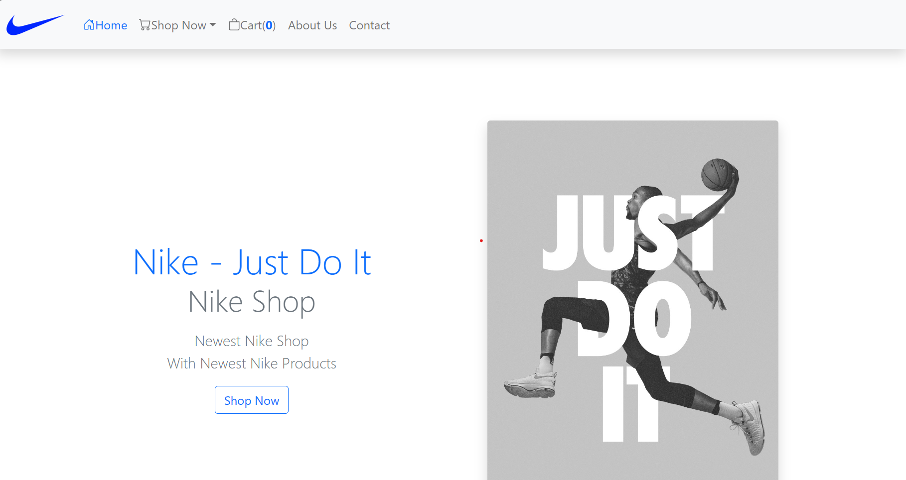

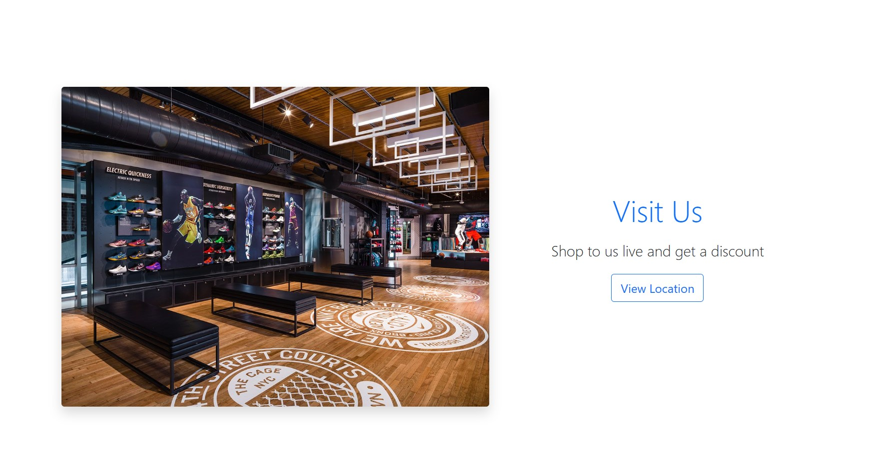

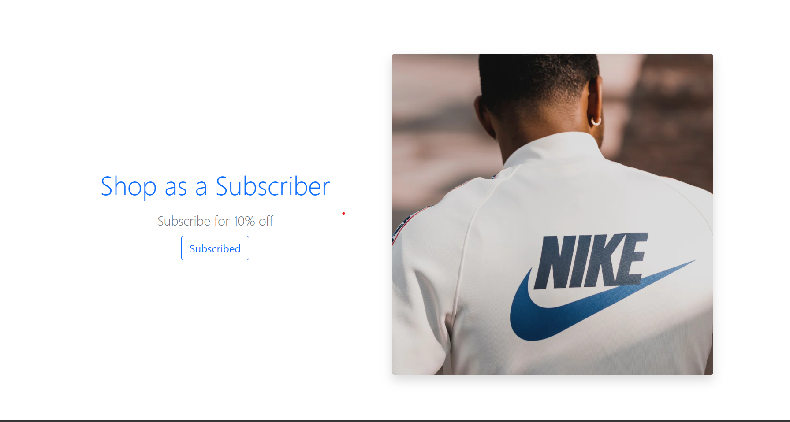

Clothing Sections

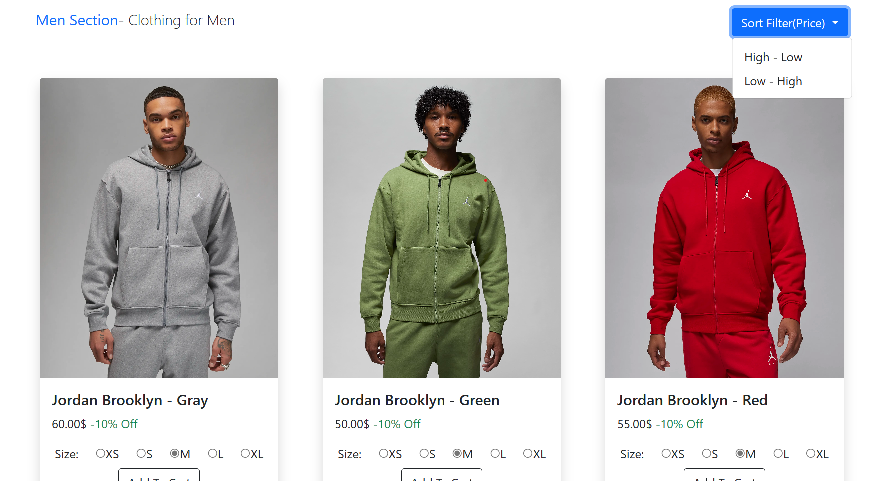

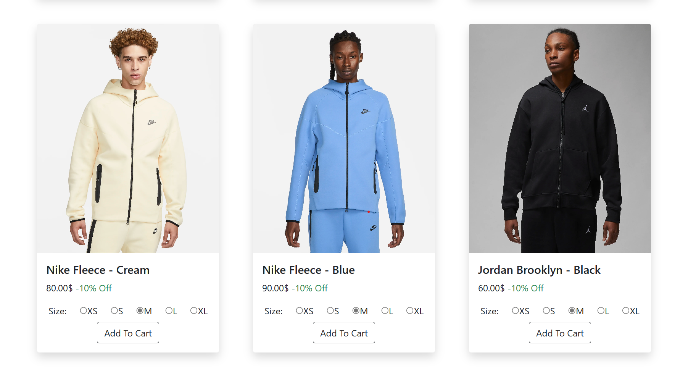

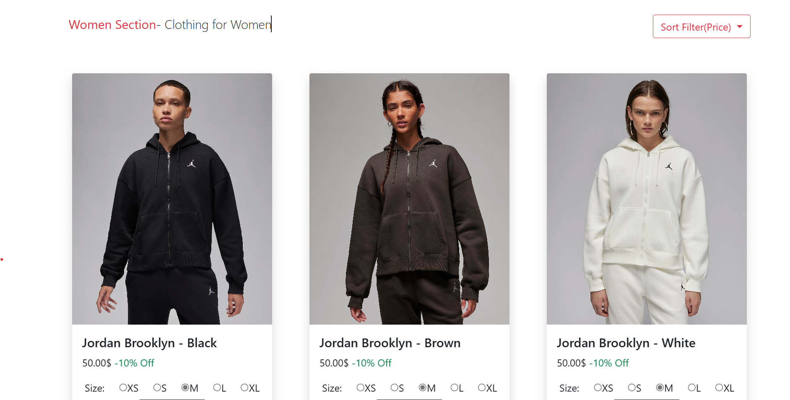

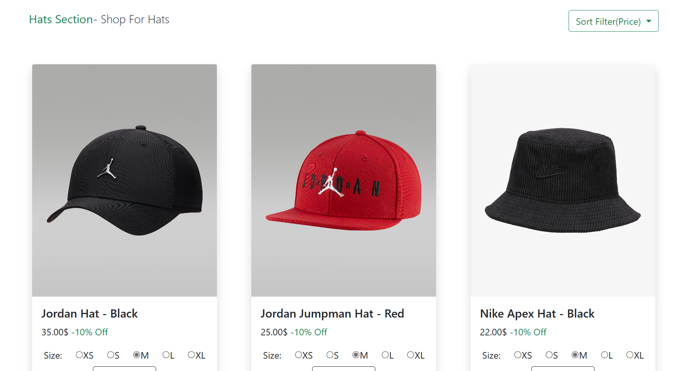

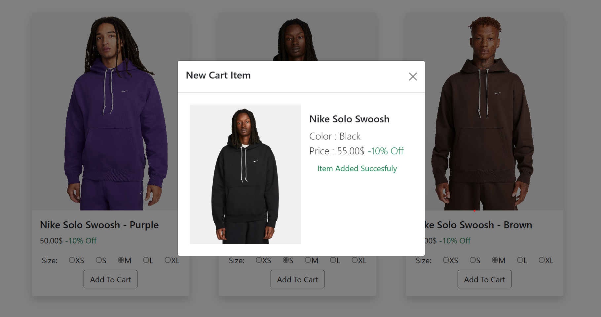

Cart Section

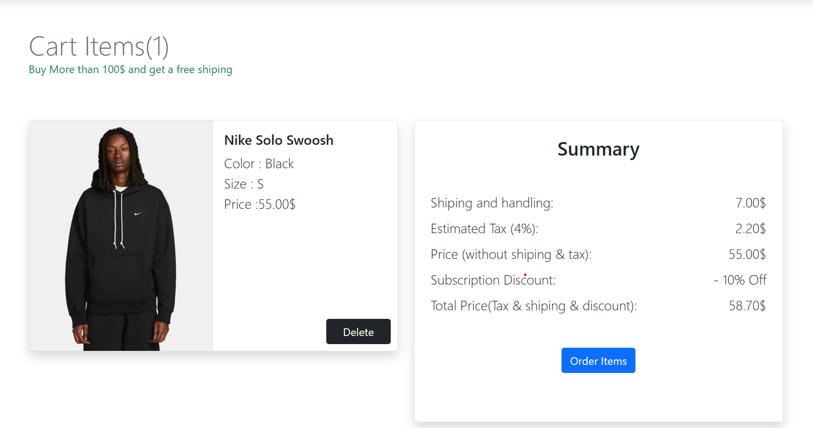

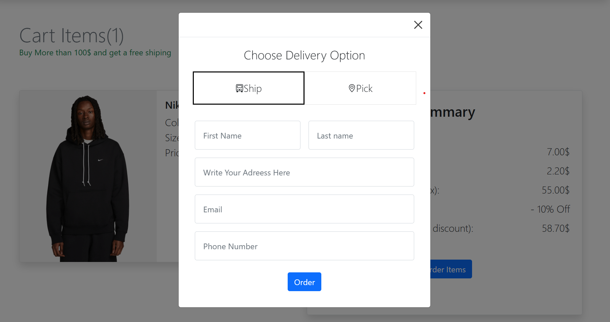

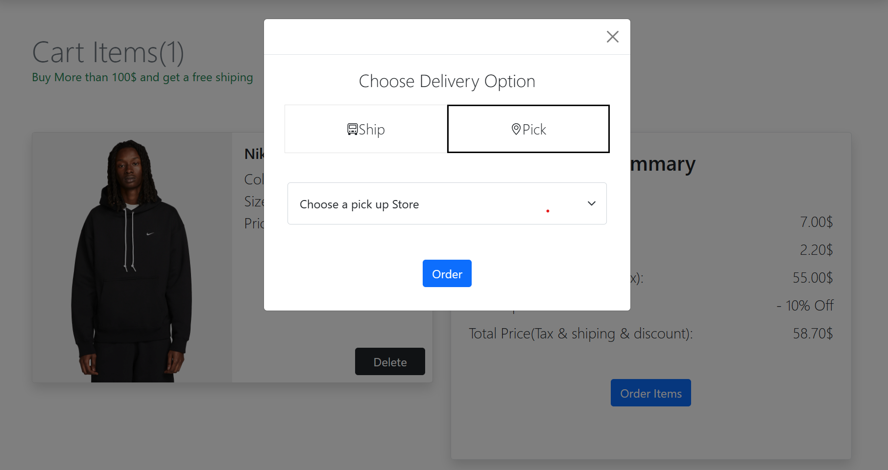

About Page

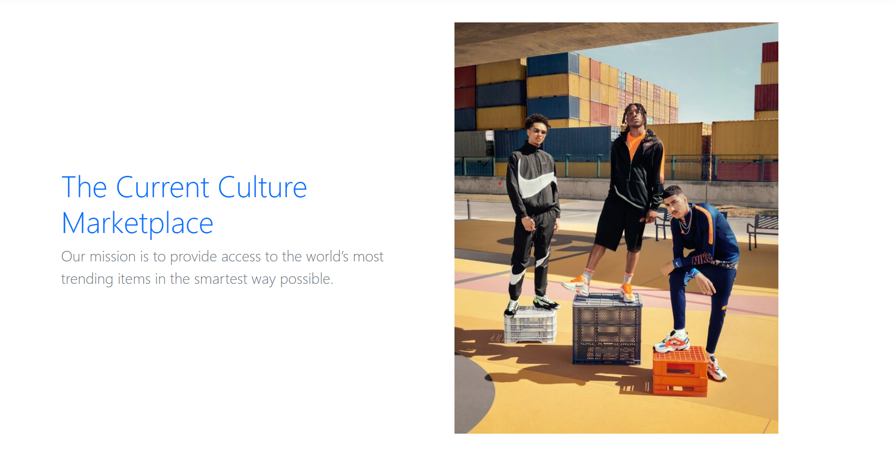
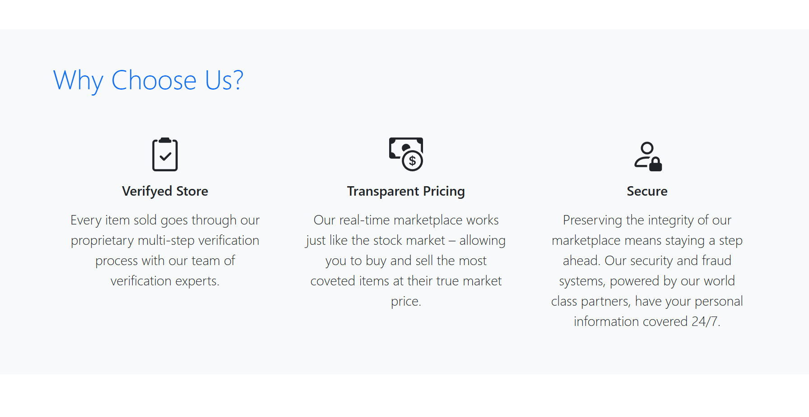
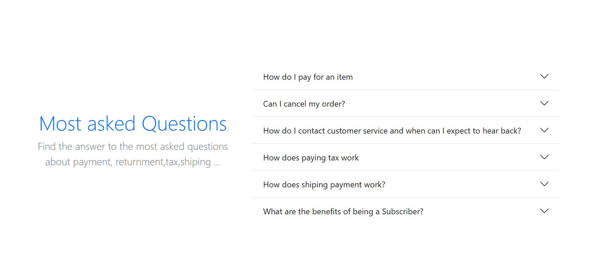

Contact Page

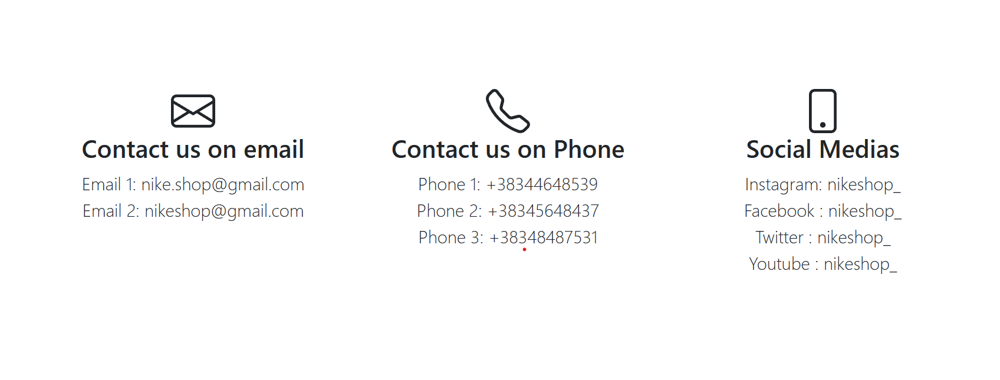
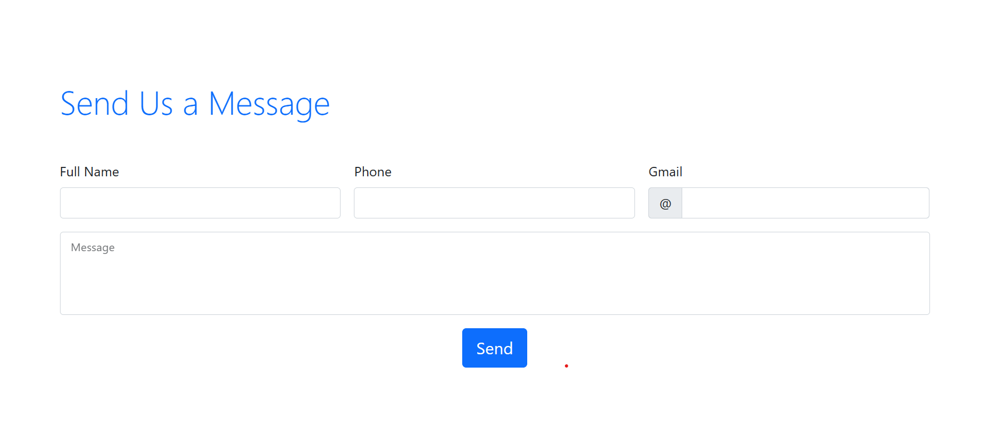
